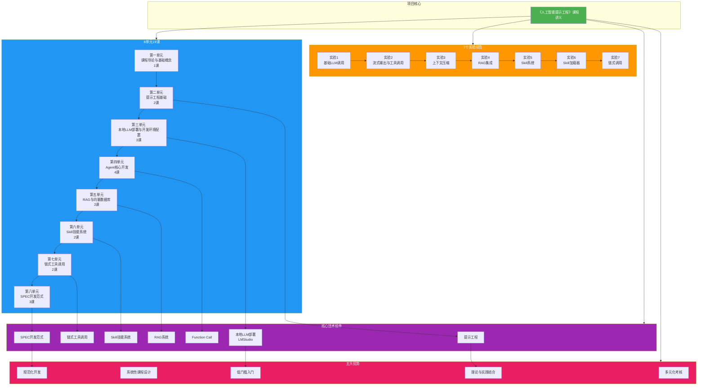
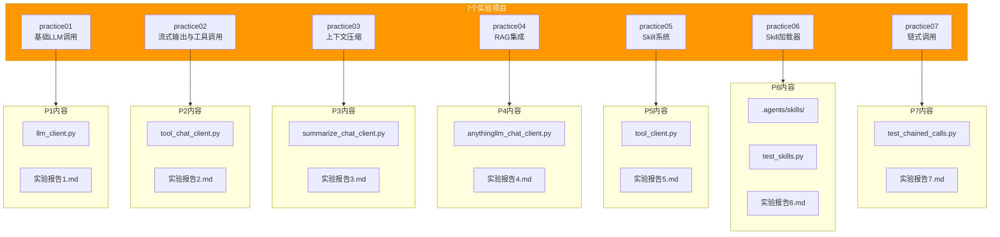
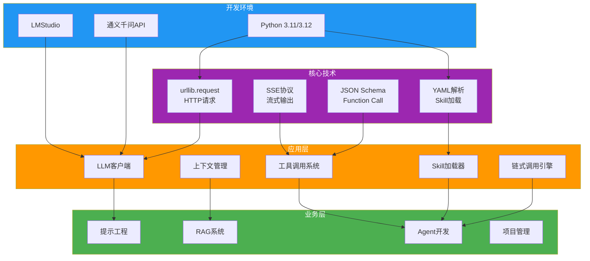
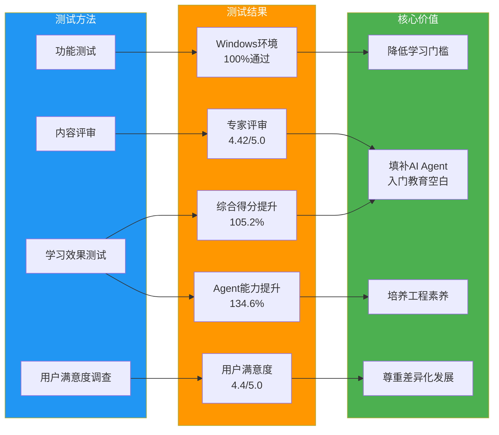
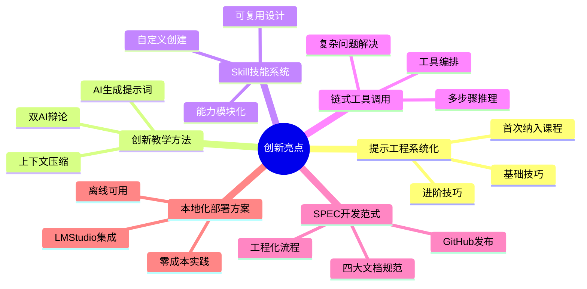

# 《人工智能提示工程》课程项目架构图

## 整体架构

```mermaid
graph TB
    subgraph 项目核心
        A[《人工智能提示工程》课程讲义]
    end

    subgraph 课程体系[8单元19课]
        U1[第一单元<br/>课程导论与基础概念<br/>1课]
        U2[第二单元<br/>提示工程基础<br/>2课]
        U3[第三单元<br/>本地LLM部署与开发环境配置<br/>3课]
        U4[第四单元<br/>Agent核心开发<br/>4课]
        U5[第五单元<br/>RAG与向量数据库<br/>2课]
        U6[第六单元<br/>Skill技能系统<br/>2课]
        U7[第七单元<br/>链式工具调用<br/>2课]
        U8[第八单元<br/>SPEC开发范式<br/>3课]
    end

    subgraph 实验配套[7个实验报告]
        P1[实验1<br/>基础LLM调用]
        P2[实验2<br/>流式输出与工具调用]
        P3[实验3<br/>上下文压缩]
        P4[实验4<br/>RAG集成]
        P5[实验5<br/>Skill系统]
        P6[实验6<br/>Skill加载器]
        P7[实验7<br/>链式调用]
    end

    subgraph 关键技术[核心技术组件]
        T1[提示工程]
        T2[本地LLM部署<br/>LMStudio]
        T3[Function Call]
        T4[RAG系统]
        T5[Skill技能系统]
        T6[链式工具调用]
        T7[SPEC开发范式]
    end

    subgraph 核心优势[五大优势]
        S1[理论与实践结合]
        S2[系统性课程设计]
        S3[低门槛入门]
        S4[规范化开发]
        S5[多元化考核]
    end

    A --> 课程体系
    A --> 实验配套
    A --> 关键技术
    A --> 核心优势

    U1 --> U2 --> U3 --> U4 --> U5 --> U6 --> U7 --> U8

    P1 --> P2 --> P3 --> P4 --> P5 --> P6 --> P7

    U2 --> T1
    U3 --> T2
    U4 --> T3
    U5 --> T4
    U6 --> T5
    U7 --> T6
    U8 --> T7

    T1 --> S1
    T2 --> S3
    T7 --> S4

    style A fill:#4CAF50,color:#fff
    style 课程体系 fill:#2196F3,color:#fff
    style 实验配套 fill:#FF9800,color:#fff
    style 关键技术 fill:#9C27B0,color:#fff
    style 核心优势 fill:#E91E63,color:#fff
```

## 课程体系详细结构

```mermaid
graph LR
    subgraph 第一单元
        L1[核心概念速览<br/>考核方式]
    end

    subgraph 第二单元
        L2[提示工程基础技巧]
        L3[提示工程进阶技巧]
    end

    subgraph 第三单元
        L4[模型参数配置]
        L5[LMStudio部署]
        L6[Python环境配置]
    end

    subgraph 第四单元
        L7[基础LLM调用]
        L8[流式输出]
        L9[Function Call]
        L10[上下文压缩]
    end

    subgraph 第五单元
        L11[AnythingLLM配置]
        L12[RAG工作流程]
    end

    subgraph 第六单元
        L13[Skill概念]
        L14[自定义Skill创建]
    end

    subgraph 第七单元
        L15[链式调用原理]
        L16[链式调用实现方法]
    end

    subgraph 第八单元
        L17[四大文档]
        L18[项目开发流程]
        L19[GitHub发布]
    end

    L1 --> L2 --> L3 --> L4 --> L5 --> L6 --> L7 --> L8 --> L9 --> L10 --> L11 --> L12 --> L13 --> L14 --> L15 --> L16 --> L17 --> L18 --> L19

    style L1 fill:#E3F2FD
    style L2 fill:#E3F2FD
    style L3 fill:#E3F2FD
    style L4 fill:#FFF3E0
    style L5 fill:#FFF3E0
    style L6 fill:#FFF3E0
    style L7 fill:#F3E5F5
    style L8 fill:#F3E5F5
    style L9 fill:#F3E5F5
    style L10 fill:#F3E5F5
    style L11 fill:#E8F5E9
    style L12 fill:#E8F5E9
    style L13 fill:#FFF8E1
    style L14 fill:#FFF8E1
    style L15 fill:#FCE4EC
    style L16 fill:#FCE4EC
    style L17 fill:#E0F7FA
    style L18 fill:#E0F7FA
    style L19 fill:#E0F7FA
```

## 实验项目结构

```mermaid
graph TB
    subgraph 实验项目[7个实验项目]
        P1[practice01<br/>基础LLM调用]
        P2[practice02<br/>流式输出与工具调用]
        P3[practice03<br/>上下文压缩]
        P4[practice04<br/>RAG集成]
        P5[practice05<br/>Skill系统]
        P6[practice06<br/>Skill加载器]
        P7[practice07<br/>链式调用]
    end

    subgraph P1内容
        P1A[llm_client.py]
        P1B[实验报告1.md]
    end

    subgraph P2内容
        P2A[tool_chat_client.py]
        P2B[实验报告2.md]
    end

    subgraph P3内容
        P3A[summarize_chat_client.py]
        P3B[实验报告3.md]
    end

    subgraph P4内容
        P4A[anythingllm_chat_client.py]
        P4B[实验报告4.md]
    end

    subgraph P5内容
        P5A[tool_client.py]
        P5B[实验报告5.md]
    end

    subgraph P6内容
        P6A[.agents/skills/]
        P6B[test_skills.py]
        P6C[实验报告6.md]
    end

    subgraph P7内容
        P7A[test_chained_calls.py]
        P7B[实验报告7.md]
    end

    P1 --> P1内容
    P2 --> P2内容
    P3 --> P3内容
    P4 --> P4内容
    P5 --> P5内容
    P6 --> P6内容
    P7 --> P7内容

    style 实验项目 fill:#FF9800,color:#fff
```

## 技术栈与依赖关系

```mermaid
graph TB
    subgraph 开发环境
        E1[Python 3.11/3.12]
        E2[LMStudio]
        E3[通义千问API]
    end

    subgraph 核心技术
        T1[urllib.request<br/>HTTP请求]
        T2[SSE协议<br/>流式输出]
        T3[YAML解析<br/>Skill加载]
        T4[JSON Schema<br/>Function Call]
    end

    subgraph 应用层
        A1[LLM客户端]
        A2[工具调用系统]
        A3[上下文管理]
        A4[Skill加载器]
        A5[链式调用引擎]
    end

    subgraph 业务层
        B1[提示工程]
        B2[RAG系统]
        B3[Agent开发]
        B4[项目管理]
    end

    E1 --> T1
    E1 --> T3
    E2 --> A1
    E3 --> A1

    T1 --> A1
    T2 --> A2
    T3 --> A4
    T4 --> A2

    A1 --> B1
    A2 --> B3
    A3 --> B2
    A4 --> B3
    A5 --> B3

    style 开发环境 fill:#2196F3,color:#fff
    style 核心技术 fill:#9C27B0,color:#fff
    style 应用层 fill:#FF9800,color:#fff
    style 业务层 fill:#4CAF50,color:#fff
```

## 项目成果验证

```mermaid
graph LR
    subgraph 测试方法
        M1[功能测试]
        M2[内容评审]
        M3[学习效果测试]
        M4[用户满意度调查]
    end

    subgraph 测试结果
        R1[Windows环境<br/>100%通过]
        R2[专家评审<br/>4.42/5.0]
        R3[综合得分提升<br/>105.2%]
        R4[Agent能力提升<br/>134.6%]
        R5[用户满意度<br/>4.4/5.0]
    end

    subgraph 核心价值
        V1[填补AI Agent<br/>入门教育空白]
        V2[降低学习门槛]
        V3[培养工程素养]
        V4[尊重差异化发展]
    end

    M1 --> R1
    M2 --> R2
    M3 --> R3
    M3 --> R4
    M4 --> R5

    R1 --> V2
    R2 --> V1
    R3 --> V1
    R4 --> V3
    R5 --> V4

    style 测试方法 fill:#2196F3,color:#fff
    style 测试结果 fill:#FF9800,color:#fff
    style 核心价值 fill:#4CAF50,color:#fff
```

## 创新亮点

```mermaid
mindmap
  root((创新亮点))
    提示工程系统化
      首次纳入课程
      基础技巧
      进阶技巧
    创新教学方法
      双AI辩论
      上下文压缩
      AI生成提示词
    Skill技能系统
      能力模块化
      可复用设计
      自定义创建
    链式工具调用
      多步骤推理
      复杂问题解决
      工具编排
    SPEC开发范式
      四大文档规范
      工程化流程
      GitHub发布
    本地化部署方案
      LMStudio集成
      零成本实践
      离线可用
```