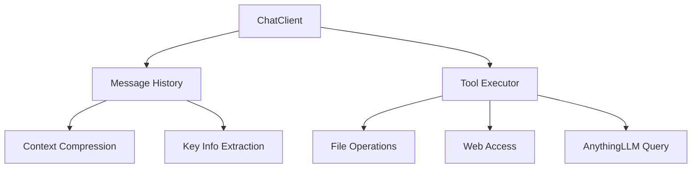

# 《人工智能Agent开发入门教程》课程讲义

## 课程概述

本课程旨在帮助学生系统掌握人工智能Agent开发的核心概念、提示工程技巧和实际开发能力。通过本课程的学习，学生将能够独立完成基于大语言模型的Agent应用开发，并产出高质量的课程成果。

---

## 第一单元：课程导论与基础概念

### 第1课：课程介绍与核心概念

#### 1.1 课程内容与考核方式

本课程采用灵活的考核方式，学生可根据自身情况选择：

| 考核方式 | 评分标准 | 最高分 |
|---------|---------|--------|
| 开发Agent + 项目报告 | 功能完整性、代码质量、创新性 | 100分 |
| 撰写课程讲义 + 项目报告 | 内容完整性、准确性、实用性 | 95分 |
| 参赛材料 + 项目报告 | 参赛质量、获奖情况 | 90分 |

#### 1.2 课程产出要求

每位学生须完成以下三项成果之一：

1. **GitHub项目**：发布完整的Agent开发项目
2. **课程讲义**：发布《人工智能Agent开发入门教程讲义》
3. **参赛文件**：输出高质量竞赛材料并获奖

#### 1.3 核心概念速览

| 概念 | 定义 | 说明 |
|-----|------|------|
| **System Prompt** | 系统级提示词 | 定义AI的角色、行为和约束 |
| **User Prompt** | 用户提示词 | 用户输入的自然语言指令 |
| **Token** | 词元 | LLM处理文本的最小单位 |
| **Context** | 上下文 | 对话历史和相关信息的集合 |
| **RAG** | 检索增强生成 | 结合外部知识库生成回答 |
| **Function Call** | 工具调用 | LLM调用外部函数的能力 |
| **Skill** | 技能 | 封装特定能力的模块 |
| **MCP** | 模型上下文协议 | Agent间通信标准 |
| **Agent** | 智能体 | 能自主决策和执行任务的AI系统 |

---

## 第二单元：提示工程基础

### 第2课：基础提示词技巧

#### 2.1 核心技巧

**1. 指定AI的角色身份**
```
你是一位资深的小说编辑，擅长构思引人入胜的故事开头。
```

**2. 描述自己的角色身份**
```
我是一位初学者作者，想创作一部100万字的科幻小说。
```

**3. 双AI辩论规划**
```
让两位AI专家就“故事应该从哪个角度切入”展开辩论，然后给出综合建议。
```

**4. 构造上下文**
```
<context>
故事背景：2157年，人类已移民火星
主角身份：28岁的火星殖民地工程师
核心冲突：地球与火星的政治对立
</context>
```

**5. 压缩上下文**
```
请将以下2000字的对话历史摘要为300字，保留关键信息和决策点。
```

#### 2.2 长篇小说创作演示

```markdown
## 系统提示词
你是一位专业的小说作家，擅长构建完整的故事世界观。

## 用户提示词
请创作一篇100万字小说的第一章，包含：
1. 开篇500字营造氛围
2. 主角登场及背景介绍
3. 核心冲突的初步暗示
4. 章节结尾留下悬念
```

### 第3课：进阶提示词技巧

#### 3.1 反向约束技巧

**输出格式约束：**
- 段落叙述格式
- 表格格式
- 列表格式

**示例 - 表格输出约束：**
```
请以表格形式输出，包含以下列：
| 角色 | 性格特点 | 关键事件 | 成长变化 |
```

#### 3.2 AI主动询问细节技巧

**策略1：一次性提出多个问题**
```
在回答问题前，请先澄清以下信息：
A. 目标受众是谁？
B. 预期的篇幅是多少？
C. 是否有特定的风格要求？
```

**策略2：分步骤提问**
```
第一步：请选择故事类型（A.科幻 B.奇幻 C.现实）
第二步：请确定主角性别
第三步：请设定核心冲突
```

#### 3.3 AI生成提示词

从示例中学习风格、结构和逻辑，不复刻内容：

```
<example>
原文：[提供示例文本]
</example>
请分析以上示例的写作风格、段落结构和逻辑顺序，
然后以相同的风格创作一篇关于[新主题]的文章。
```

---

## 第三单元：本地LLM部署与开发环境配置

### 第4课：LLM模型基础

#### 4.1 模型参数解读

| 参数 | 含义 | 示例 |
|-----|------|------|
| **xxB** | 模型参数量 | 7B=70亿参数 |
| **MoE架构** | 混合专家模型 | Qwen3.5-35B-A3B |
| **Q4/Q6** | 量化级别 | Q4比原模型小约4倍 |

#### 4.2 模型加载参数

```
Context Length: 上下文长度（如8192 tokens）
KV Cache: 键值缓存，加速推理
批处理大小: 同时处理的任务数
KV缓存卸载: 将缓存移到GPU内存
```

### 第5课：LMStudio安装与配置

#### 5.1 安装指南

**Nvidia显卡用户：**
1. 下载LMStudio软件
2. 根据显存大小选择合适的qwen模型
3. 确保模型大小小于显存容量

**AMD显卡/轻薄本用户：**
1. 使用CPU运行LMStudio（较慢）
2. 或使用在线服务：
   - 通义千问/DeepSeek网站（注册送500万token）
   - MiniMax会员（¥29元/月）

### 第6课：开发环境配置

#### 6.1 Python环境

```bash
# 检查Python版本
python --version  # 需要3.12+

# 创建虚拟环境
python -m venv venv

# 激活虚拟环境
# Windows:
venv\Scripts\activate
# Mac/Linux:
source venv/bin/activate
```

#### 6.2 Git配置

```bash
# 配置用户信息
git config --global user.name "Your Name"
git config --global user.email "your.email@example.com"

# 初始化仓库
git init
git add .
git commit -m "Initial commit"
```

---

## 第四单元：Agent核心开发

### 第7课：基础LLM交互

#### 7.1 环境配置模板

创建`.env.example`文件：

```env
BASE_URL=http://localhost:1234/v1
API_KEY=your-api-key-here
MODEL=your-model-name
```

#### 7.2 基础调用代码

```python
# practice01/llm_client.py
import os
import json
import time
import urllib.request
from dotenv import load_dotenv

# 加载环境变量
load_dotenv()

def call_llm(messages):
    """调用LLM API"""
    url = f"{os.getenv('BASE_URL')}/chat/completions"
    
    payload = {
        "model": os.getenv("MODEL"),
        "messages": messages,
        "stream": False
    }
    
    start_time = time.time()
    
    req = urllib.request.Request(
        url,
        data=json.dumps(payload).encode(),
        headers={"Content-Type": "application/json"}
    )
    
    with urllib.request.urlopen(req) as response:
        result = json.loads(response.read())
    
    elapsed_time = time.time() - start_time
    
    # 统计信息
    tokens_used = result.get('usage', {}).get('total_tokens', 0)
    tokens_per_sec = tokens_used / elapsed_time if elapsed_time > 0 else 0
    
    print(f"⏱️ 耗时: {elapsed_time:.2f}s")
    print(f"📊 Token消耗: {tokens_used}")
    print(f"⚡ 速度: {tokens_per_sec:.2f} tokens/s")
    
    return result['choices'][0]['message']['content']
```

### 第8课：流式输出与对话历史

#### 8.1 流式聊天客户端

```python
# practice02/chat_client.py
import os
import json
import urllib.request
from dotenv import load_dotenv

load_dotenv()

class ChatClient:
    def __init__(self):
        self.messages = []
        self.base_url = os.getenv("BASE_URL")
        self.api_key = os.getenv("API_KEY")
        self.model = os.getenv("MODEL")
    
    def add_message(self, role, content):
        """添加消息到历史"""
        self.messages.append({"role": role, "content": content})
    
    def stream_chat(self, user_input):
        """流式聊天"""
        self.add_message("user", user_input)
        
        payload = {
            "model": self.model,
            "messages": self.messages,
            "stream": True
        }
        
        # 流式请求处理...
        # [详细实现见课程代码]
        
        return response
    
    def run(self):
        """运行聊天循环"""
        print("聊天客户端启动 (输入 Ctrl+C 退出)")
        
        while True:
            try:
                user_input = input("\n你: ")
                if user_input.lower() == 'exit':
                    break
                
                response = self.stream_chat(user_input)
                print(f"AI: {response}")
                
            except KeyboardInterrupt:
                print("\n再见！")
                break
```

### 第9课：Function Call工具调用

#### 9.1 工具定义

```python
# practice02/tool_chat_client.py
tools = [
    {
        "type": "function",
        "function": {
            "name": "list_files",
            "description": "列出目录下的所有文件",
            "parameters": {
                "type": "object",
                "properties": {
                    "directory": {"type": "string", "description": "目录路径"}
                },
                "required": ["directory"]
            }
        }
    },
    {
        "type": "function",
        "function": {
            "name": "read_file",
            "description": "读取文件内容",
            "parameters": {
                "type": "object",
                "properties": {
                    "file_path": {"type": "string", "description": "文件路径"}
                },
                "required": ["file_path"]
            }
        }
    },
    {
        "type": "function",
        "function": {
            "name": "write_file",
            "description": "写入文件内容",
            "parameters": {
                "type": "object",
                "properties": {
                    "file_path": {"type": "string", "description": "文件路径"},
                    "content": {"type": "string", "description": "文件内容"}
                },
                "required": ["file_path", "content"]
            }
        }
    },
    {
        "type": "function",
        "function": {
            "name": "rename_file",
            "description": "重命名文件",
            "parameters": {
                "type": "object",
                "properties": {
                    "old_path": {"type": "string"},
                    "new_path": {"type": "string"}
                },
                "required": ["old_path", "new_path"]
            }
        }
    },
    {
        "type": "function",
        "function": {
            "name": "delete_file",
            "description": "删除文件",
            "parameters": {
                "type": "object",
                "properties": {
                    "file_path": {"type": "string"}
                },
                "required": ["file_path"]
            }
        }
    }
]
```

#### 9.2 工具实现

```python
def execute_tool(tool_name, arguments):
    """执行工具调用"""
    if tool_name == "list_files":
        import os
        files = os.listdir(arguments["directory"])
        return "\n".join(files)
    
    elif tool_name == "read_file":
        with open(arguments["file_path"], 'r', encoding='utf-8') as f:
            return f.read()
    
    elif tool_name == "write_file":
        with open(arguments["file_path"], 'w', encoding='utf-8') as f:
            f.write(arguments["content"])
        return f"文件已写入: {arguments['file_path']}"
    
    elif tool_name == "rename_file":
        import os
        os.rename(arguments["old_path"], arguments["new_path"])
        return f"已重命名: {arguments['old_path']} -> {arguments['new_path']}"
    
    elif tool_name == "delete_file":
        import os
        os.remove(arguments["file_path"])
        return f"已删除: {arguments['file_path']}"
    
    return "未知工具"
```

### 第10课：上下文压缩

#### 10.1 压缩策略

```python
# practice03/chat_with_compression.py
class CompressedChatClient:
    def __init__(self, max_rounds=5, max_tokens=3000):
        self.messages = []
        self.max_rounds = max_rounds
        self.max_tokens = max_tokens
        self.compression_ratio = 0.7  # 压缩前70%的内容
    
    def should_compress(self):
        """判断是否需要压缩"""
        rounds = len([m for m in self.messages if m['role'] == 'user'])
        return rounds > self.max_rounds or self.estimate_tokens() > self.max_tokens
    
    def compress_context(self):
        """压缩上下文"""
        # 保留最后30%的原始内容
        keep_count = int(len(self.messages) * 0.3)
        recent_messages = self.messages[-keep_count:]
        
        # 压缩前70%的内容
        old_messages = self.messages[:-keep_count]
        summary = self.generate_summary(old_messages)
        
        # 重建消息历史
        self.messages = [
            {"role": "system", "content": f"历史摘要：{summary}"}
        ] + recent_messages
    
    def generate_summary(self, messages):
        """生成摘要"""
        # 调用LLM生成摘要
        # [实现细节]
        pass
```

#### 10.2 关键信息提取

```python
def extract_key_info(messages):
    """按5W规则提取关键信息"""
    prompt = """
    请从以下对话中提取关键信息，按5W规则：
    - Who: 谁
    - What: 做了什么/发生了什么
    - When: 什么时候（可选）
    - Where: 在何处（可选）
    - Why: 为什么要做（可选）
    
    对话内容：
    {messages}
    
    输出JSON格式：
    {"entries": [{"who": "", "what": "", "when": "", "where": "", "why": ""}]}
    """
    # 调用LLM提取
    pass
```

---

## 第五单元：RAG与向量数据库

### 第11课：AnythingLLM配置

#### 11.1 安装与基本配置

1. 下载安装AnythingLLM
2. 配置LMStudio作为模型后端
3. 创建工作区并添加文档
4. 开启本地服务（端口3001）

#### 11.2 API调用

```python
# practice04/anythingllm_integration.py
import subprocess
import json
import os
from dotenv import load_dotenv

load_dotenv()

def query_anythingllm(question):
    """通过curl调用AnythingLLM API"""
    workspace_slug = os.getenv("ANYTHINGLLM_WORKSPACE_SLUG")
    api_key = os.getenv("ANYTHINGLLM_API_KEY")
    
    cmd = [
        "curl", "-X", "POST",
        f"http://localhost:3001/api/v1/workspace/{workspace_slug}/chat",
        "-H", f"Authorization: Bearer {api_key}",
        "-H", "Content-Type: application/json",
        "-d", json.dumps({"message": question, "mode": "chat"})
    ]
    
    result = subprocess.run(cmd, capture_output=True, text=True)
    response = json.loads(result.stdout)
    
    return response.get("textResponse", "")
```

### 第12课：RAG工作流程

```
用户查询
    ↓
向量化查询
    ↓
相似度检索（从向量数据库）
    ↓
检索相关内容
    ↓
构建增强提示词
    ↓
LLM生成回答
    ↓
返回结果
```

---

## 第六单元：Skill技能系统

### 第13课：Skill概念与结构

#### 13.1 SKILL.md文件格式

```markdown
---
name: notice-writer
description: 撰写通知、修改通知、润色通知时使用
---

# 通知撰写规范

## 核心要求
1. 通知不能以"通知"二字开头
2. 必须冠以"XX部"的前缀
3. 如果用户未提供部门，使用"XX部"代替

## 格式示例
XX部通知

[正文内容]

XX部
YYYY年MM月DD日
```

#### 13.2 Skill加载器实现

```python
# practice06/skill_loader.py
import os
import yaml
from pathlib import Path

class SkillLoader:
    def __init__(self, project_root):
        self.skills_dir = Path(project_root) / ".agents" / "skills"
        self.skills = {}
        self.load_all_skills()
    
    def load_all_skills(self):
        """加载所有技能"""
        if not self.skills_dir.exists():
            return
        
        for skill_dir in self.skills_dir.iterdir():
            if skill_dir.is_dir():
                skill_file = skill_dir / "SKILL.md"
                if skill_file.exists():
                    self.load_skill(skill_file)
    
    def load_skill(self, skill_file):
        """加载单个技能"""
        content = skill_file.read_text(encoding='utf-8')
        
        # 解析YAML front matter
        if content.startswith('---'):
            parts = content.split('---', 2)
            front_matter = yaml.safe_load(parts[1])
            body = parts[2].strip()
            
            name = front_matter.get('name')
            description = front_matter.get('description')
            
            self.skills[name] = {
                'description': description,
                'content': body
            }
    
    def list_skills(self):
        """列出所有可用技能"""
        return [
            {"name": name, "description": info['description']}
            for name, info in self.skills.items()
        ]
    
    def get_skill_content(self, skill_name):
        """获取技能内容"""
        if skill_name in self.skills:
            return self.skills[skill_name]['content']
        return None
```

### 第14课：创建自定义Skill

#### 14.1 init-article Skill

用于生成规范文档的Skill结构：

```
init-article/
└── SKILL.md
```

SKILL.md内容：

```markdown
---
name: init-article
description: 生成文章撰写的规范文件，包括topic.md, voice.md, structure.md, check.md
---

# 文章规范文件生成器

## 功能说明
生成四类规范文件：
1. **topic.md** - 规范主题，避免偏题
2. **voice.md** - 规范语气、文字风格
3. **structure.md** - 规范文档结构和提纲
4. **check.md** - 约定如何检查文档质量

## 使用方式
用户输入：/init-article [文章主题] [作者身份] [其他要求]

## 输出格式
在当前目录生成四个.md文件：
- topic.md
- voice.md
- structure.md
- check.md
```

---

## 第七单元：链式工具调用

### 第15课：链式调用原理

链式工具调用允许前一个工具的输出作为后一个工具的输入，实现复杂的多步骤任务。

```
用户请求
    ↓
LLM分析（决定第一步）
    ↓
执行工具1 → 结果1
    ↓
LLM分析（基于结果1决定第二步）
    ↓
执行工具2 → 结果2
    ↓
...（最多max_iterations次）
    ↓
返回最终答案
```

### 第16课：链式调用实现

```python
# practice07/chained_tool_client.py
class ChainedCallContext:
    """链式调用上下文管理器"""
    def __init__(self):
        self.steps = []  # 记录每一步的调用
        self.variables = {}  # 存储中间变量
        self.max_iterations = 10
    
    def add_step(self, tool_name, arguments, result):
        self.steps.append({
            "step": len(self.steps) + 1,
            "tool": tool_name,
            "arguments": arguments,
            "result": result
        })
    
    def get_history(self):
        """获取执行历史"""
        return self.steps

def build_analysis_prompt(user_request, history):
    """构建分析提示词"""
    prompt = f"""
## 用户原始请求
{user_request}

## 已执行的工具调用历史
{json.dumps(history, ensure_ascii=False, indent=2)}

## 决策规则
- 如果任务已完成，返回 {{"done": true, "answer": "最终回答"}}
- 如果需要继续调用工具，返回 {{"done": false, "tool_call": {{"name": "工具名", "arguments": {{...}}}}}}
- 最多执行{max_iterations}次工具调用

## 可用工具
{get_available_tools_description()}

请决定下一步操作：
"""
    return prompt

def execute_chained_tool_call(user_request, max_iterations=10):
    """执行链式工具调用"""
    context = ChainedCallContext()
    messages = [{"role": "user", "content": user_request}]
    
    for iteration in range(max_iterations):
        # 构建分析提示词
        analysis_prompt = build_analysis_prompt(user_request, context.steps)
        
        # 调用LLM决策
        decision = call_llm_for_decision(analysis_prompt)
        
        if decision.get("done"):
            return decision.get("answer")
        
        # 执行工具调用
        tool_call = decision.get("tool_call")
        if tool_call:
            result = execute_tool(
                tool_call["name"],
                tool_call["arguments"]
            )
            context.add_step(
                tool_call["name"],
                tool_call["arguments"],
                result
            )
            
            # 将结果添加到消息历史
            messages.append({
                "role": "assistant",
                "content": f"执行{tool_call['name']}的结果：{result}"
            })
    
    return "达到最大迭代次数，任务未完成"
```

---

## 第八单元：SPEC开发范式

### 第17课：SPEC四大文档

| 文档 | 用途 | 内容 |
|-----|------|------|
| **spec.md** | 项目规格说明 | 项目目标、功能范围、技术栈 |
| **requirement.md** | 需求文档 | 功能需求、非功能需求、用户故事 |
| **api.md** | API设计文档 | 接口定义、参数说明、伪代码 |
| **test.md** | 测试计划 | 测试用例、验收标准 |

#### 17.1 spec.md模板

```markdown
# 项目规格说明书

## 项目概述
[项目名称和简要描述]

## 目标用户
[用户画像和使用场景]

## 核心功能
1. [功能1]
2. [功能2]
3. [功能3]

## 技术栈
- 后端：[框架/语言]
- 前端：[框架/库]
- 数据库：[类型]
- LLM：[模型名称]

## 约束条件
- [技术约束]
- [时间约束]
- [资源约束]
```

#### 17.2 requirement.md模板

```markdown
# 需求文档

## 功能需求
### FR-01：[需求名称]
- 描述：[详细描述]
- 优先级：高/中/低
- 验收标准：[如何验证]

## 非功能需求
### NFR-01：性能
- 响应时间 < [X]秒
- 并发用户数 > [X]

### NFR-02：可用性
- [可用性要求]
```

#### 17.3 api.md模板

```markdown
# API设计文档

## 函数1：[函数名]
### 功能描述
[描述函数的作用]

### 输入参数
| 参数名 | 类型 | 必填 | 描述 |
|-------|------|-----|------|
| param1 | string | 是 | [描述] |

### 伪代码
```
function_name(param1, param2):
    # 步骤1
    # 步骤2
    return result
```

### 返回值
| 字段 | 类型 | 描述 |
|-----|------|------|
| status | string | 状态 |
| data | object | 返回数据 |
```

#### 17.4 test.md模板

```markdown
# 测试计划

## 测试用例1：[用例名称]
- 前置条件：[条件]
- 测试步骤：
  1. [步骤1]
  2. [步骤2]
- 预期结果：[结果]
- 实际结果：[留空]

## 验收标准
- [ ] 标准1
- [ ] 标准2
```

---

## 第九单元：代码质量与文档

### 第18课：代码结构分析

#### 18.1 使用pyan3生成代码结构图

```bash
# 安装pyan3
pip install pyan3

# 生成HTML格式的代码结构图
pyan3 practice02/*.py --html --grouped --file practice02/project_structure.html

# 生成SVG格式
pyan3 practice02/*.py --dot --grouped | dot -Tsvg -o practice02/project_structure.svg
```

#### 18.2 使用Mermaid生成架构图



### 第19课：GitHub项目维护

#### 19.1 README.md模板

```markdown
# 项目名称

## 项目简介
[一句话描述项目]

## 功能特性
- ✅ 特性1
- ✅ 特性2
- 🔄 开发中

## 环境要求
- Python 3.12+
- [其他依赖]

## 快速开始

### 1. 克隆项目
```bash
git clone [repository-url]
cd [project-name]
```

### 2. 配置环境
```bash
python -m venv venv
source venv/bin/activate  # Windows: venv\Scripts\activate
pip install -r requirements.txt
```

### 3. 配置文件
```bash
cp .env.example .env
# 编辑.env文件，填入配置信息
```

### 4. 运行
```bash
python main.py
```

## 项目结构
```
├── practice01/    # 基础LLM调用
├── practice02/    # 工具调用实现
├── practice03/    # 上下文压缩
├── practice04/    # RAG集成
├── practice05/    # 完整Agent
├── practice06/    # Skill系统
├── practice07/    # 链式调用
└── .agents/
    └── skills/    # 技能定义
```

## 更新日志
### v1.0.0 (YYYY-MM-DD)
- 初始版本发布
```

#### 19.2 GitHub个人首页

创建与GitHub用户名同名的仓库，其中的README.md将显示在个人主页：

```markdown
# 👋 你好，我是[你的名字]

## 🚀 关于我
- 🎓 [学校/专业]
- 🤖 专注于AI Agent开发
- 📚 正在学习[技术栈]

## 📈 GitHub统计


## 🏆 项目
| 项目 | 描述 | 技术栈 |
|-----|------|--------|
| [项目1] | [描述] | Python, LLM |
| [项目2] | [描述] | RAG, Agent |

## 📫 联系我
- Email: [邮箱]
```

---

## 附录

### 附录A：常用命令速查

```bash
# Python虚拟环境
python -m venv venv
venv\Scripts\activate  # Windows
source venv/bin/activate  # Mac/Linux

# Git操作
git init
git add .
git commit -m "message"
git remote add origin <url>
git push -u origin main

# 包安装
pip install python-dotenv urllib3

# 代码结构分析
pyan3 *.py --html --grouped --file structure.html
```

### 附录B：环境变量配置

```env
# .env文件示例
BASE_URL=http://localhost:1234/v1
API_KEY=your-api-key
MODEL=qwen3.5-7b

# AnythingLLM配置
ANYTHINGLLM_API_KEY=your-api-key
ANYTHINGLLM_WORKSPACE_SLUG=your-workspace-slug

# OpenRouter配置（在线LLM）
OPENROUTER_BASE_URL=https://openrouter.ai/api/v1
OPENROUTER_API_KEY=sk-or-v1-...
OPENROUTER_MODEL=qwen/qwen3-coder:free
```

### 附录C：常见问题解决

| 问题 | 解决方案 |
|-----|---------|
| 中文乱码 | 确保文件编码为UTF-8，添加`encoding='utf-8'` |
| API连接失败 | 检查BASE_URL和端口是否正确 |
| 模型加载慢 | 尝试更小的量化版本（如Q4） |
| 上下文超长 | 启用上下文压缩功能 |
| 工具调用不执行 | 检查system prompt中是否包含工具描述 |

### 附录D：推荐资源

- **Skill资源站**：https://skillhub.cn/
- **MiniMax Skills**：https://github.com/MiniMax-AI/skills/
- **中国大学生计算机设计大赛**：http://jsjds.blcu.edu.cn/
- **OpenRouter**：https://openrouter.ai/（在线LLM聚合平台）

---

## 结语

本课程涵盖了从提示工程基础到复杂Agent系统开发的完整知识体系。通过动手实践，你将掌握：

1. **提示工程**：从基础到高级的提示词技巧
2. **本地LLM部署**：LMStudio配置与优化
3. **工具调用**：Function Call的完整实现
4. **RAG技术**：向量数据库与文档检索
5. **Skill系统**：可复用的能力模块化
6. **链式调用**：复杂任务的自动化执行
7. **SPEC开发**：规范化的项目开发流程

记住：**实践是最好的学习方式**。每个知识点都配套了实验代码，请务必亲自动手运行、修改、调试。遇到问题时，查阅代码注释和实验报告，或与同学讨论。